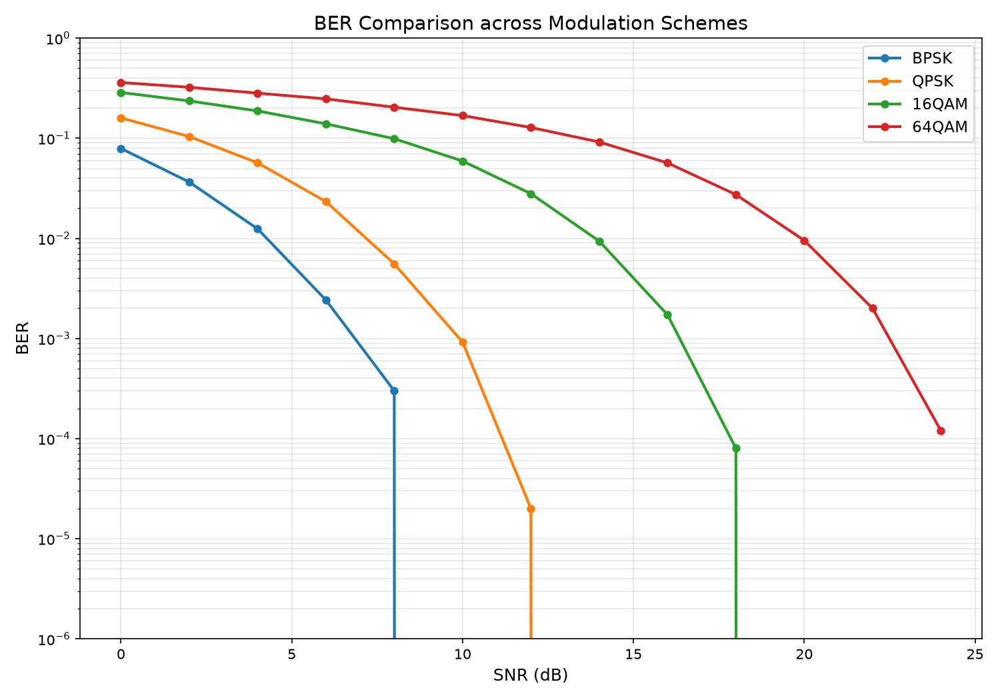
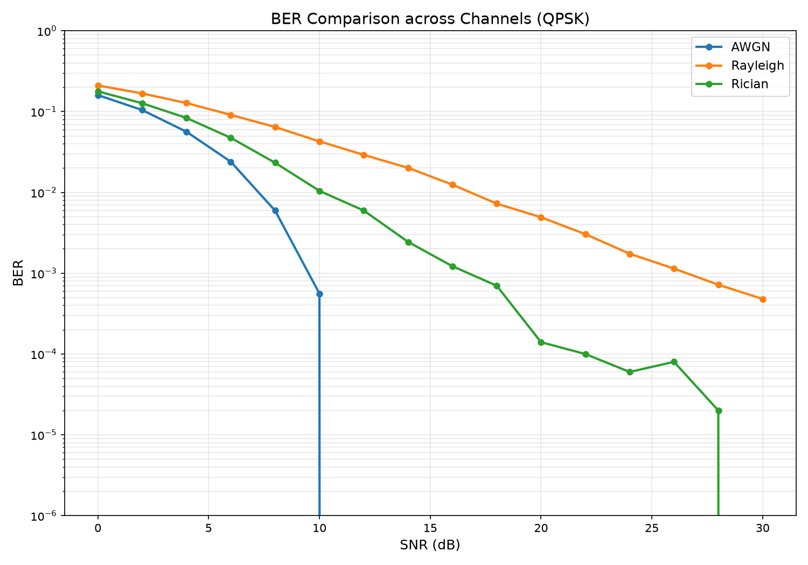
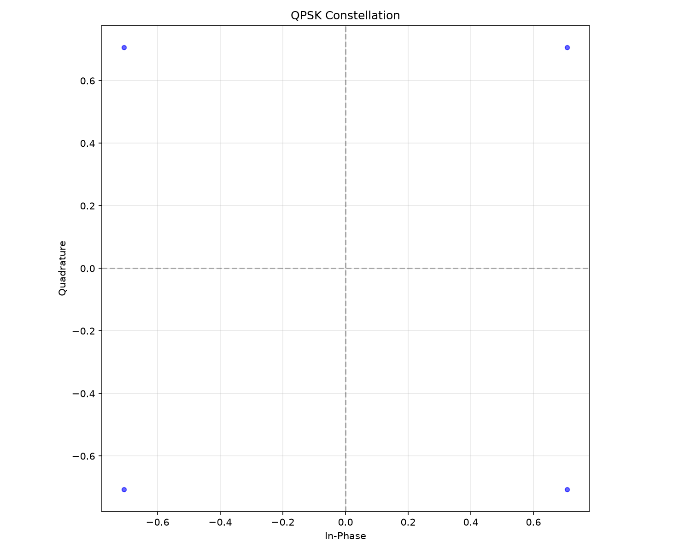
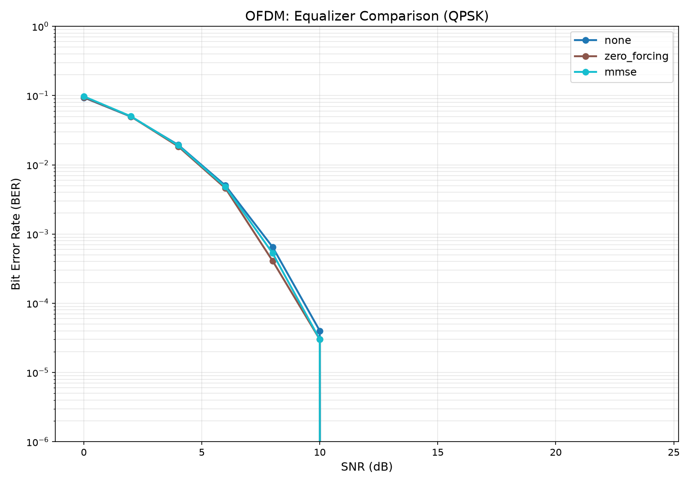
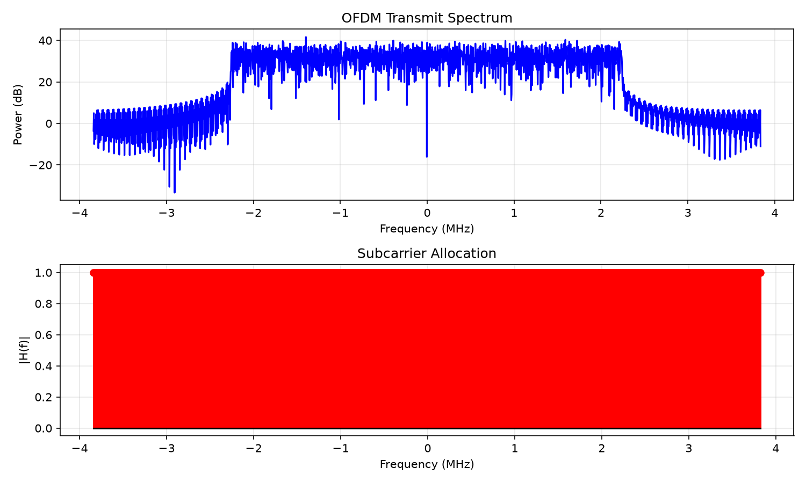
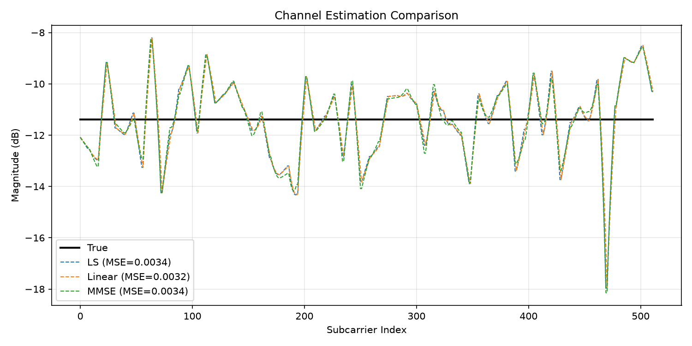
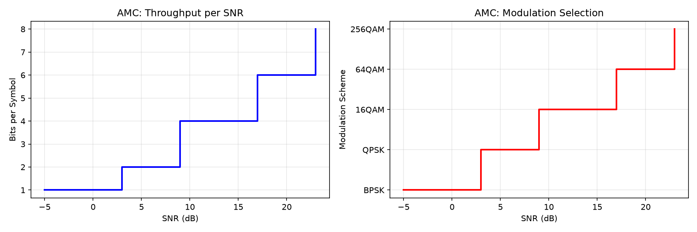
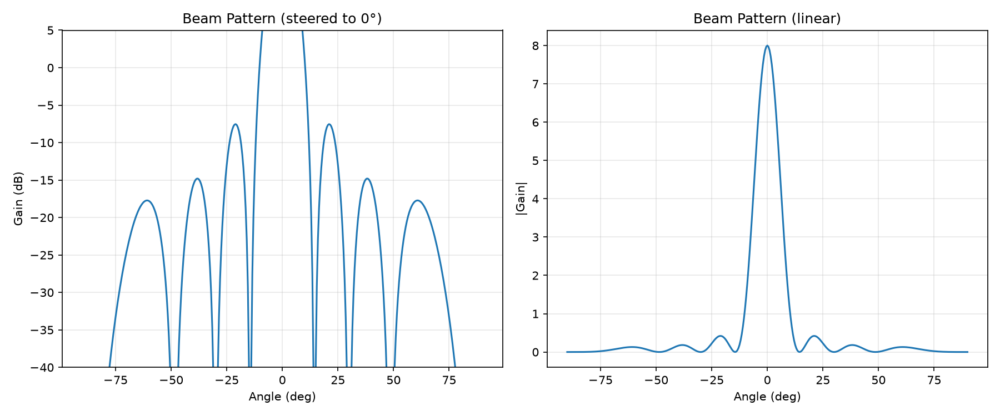
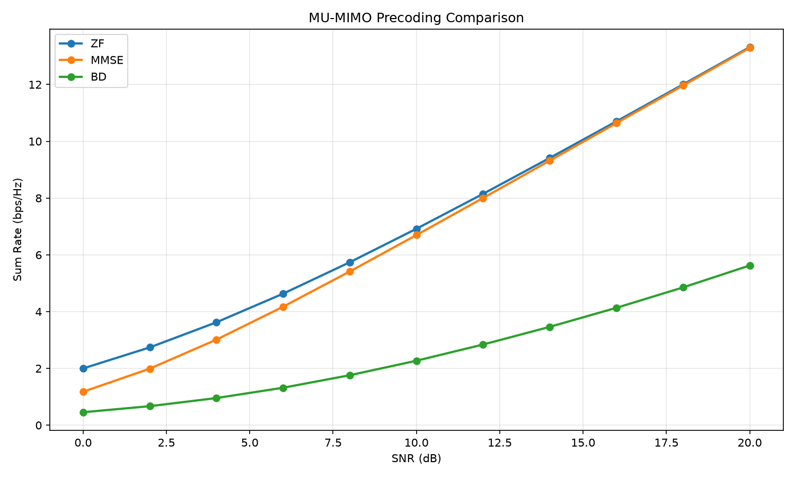
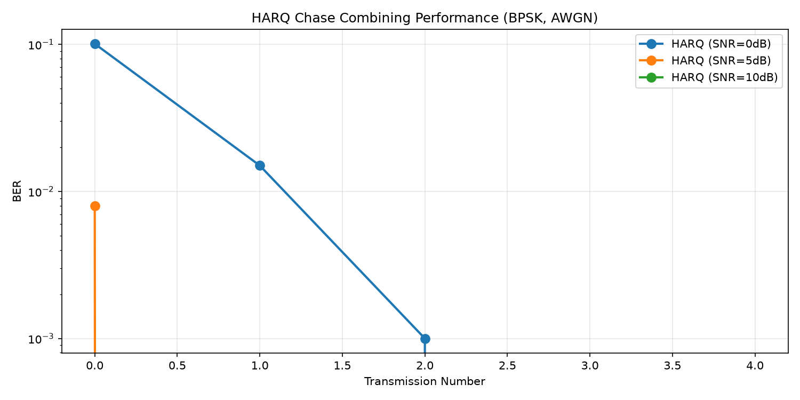

# 5G-NR Wireless Communication Simulator

A modular **5G New Radio Physical Layer** simulation framework written in Python. Models the end-to-end transmission chain, evaluates performance under realistic wireless channels, and produces publication-quality visualizations.

## Features

- **Modulation**: BPSK, QPSK, 16-QAM, 64-QAM with Gray coding
- **Channel Models**: AWGN, Rayleigh fading, Rician fading, Doppler effect (Jakes spectrum)
- **OFDM**: FFT/IFFT, cyclic prefix insertion/removal, subcarrier mapping
- **MIMO**: 2×2 spatial multiplexing, Alamouti STBC, receive diversity (MRC/EGC/SC)
- **Equalization**: Zero Forcing, MMSE
- **5G NR Numerology**: 15/30/60/120/240 kHz subcarrier spacings, slot & frame structure
- **Performance Analysis**: BER, SER, throughput, spectral efficiency, latency
- **Visualization**: Constellation diagrams, BER curves, channel responses, spectrum
- **Interactive Dashboard**: Streamlit-based UI for real-time parameter exploration

## Project Structure

```
5G-NR-Simulator/
├── main.py                  # CLI entry point
├── config.py                # Simulation configuration
├── simulation_controller.py # Core controller orchestrating TX → Channel → RX
├── dashboard.py             # Streamlit interactive dashboard
├── requirements.txt
├── transmitter/             # Bit generation, modulation, coding, resource mapping
├── receiver/                # Demodulation, decoding, equalization, detection
├── channel/                 # AWGN, Rayleigh, Rician, Doppler models
├── ofdm/                    # OFDM transmitter/receiver, FFT, cyclic prefix
├── mimo/                    # 2×2 MIMO, Alamouti, diversity combining
├── numerology/              # Subcarrier spacing, frame structure
├── analysis/                # BER, throughput, latency, spectral efficiency
├── visualization/           # Constellation, BER, channel, spectrum plotting
├── experiments/             # Pre-built experiment scripts
├── reports/                 # Generated output graphs
└── docs/                    # Documentation
```

## Installation

```bash
# Clone the repository
git clone https://github.com/yourusername/5G-NR-Simulator.git
cd 5G-NR-Simulator

# Install dependencies
pip install -r requirements.txt
```

## Usage

### Command Line

```bash
# Run predefined experiments
python main.py --experiment 1   # Modulation comparison
python main.py --experiment 2   # Channel comparison
python main.py --experiment 3   # OFDM with equalization

# Run full analysis with custom parameters
python main.py --full-analysis --modulation QPSK --channel AWGN --snr-range 0,26,2

# Show constellation diagram
python main.py --constellation --modulation 16QAM

# Show numerology information
python main.py --numerology 1

# Custom simulation
python main.py --modulation 64QAM --channel Rayleigh --num-bits 100000 --snr-range 5,35,3
```

### Interactive Dashboard

```bash
streamlit run dashboard.py
```

### Running Experiments

```bash
python experiments/experiment1.py
python experiments/experiment2.py
python experiments/experiment3.py
```

## Architecture

```
                   main.py
                      │
              Simulation Controller
                      │
       ┌──────────────┼──────────────┐
       ▼              ▼              ▼
  Transmitter      Channel       Receiver
       │              │              │
       ▼              ▼              ▼
  Bit Gen ──► Mod ──► OFDM ──► Demod ──► BER
                   │
                   ▼
              Visualization
```

## Key Performance Metrics

- **BER / SER**: Bit and symbol error rates vs SNR
- **Throughput**: Effective data rate accounting for errors
- **Spectral Efficiency**: bps/Hz
- **Latency**: End-to-end delay including retransmissions
- **PAPR**: Peak-to-average power ratio (OFDM)

## 5G NR Numerologies

| μ | SCS (kHz) | Slot Duration | Typical Use |
|---|-----------|---------------|-------------|
| 0 | 15        | 1 ms          | Sub-6 GHz, wide area |
| 1 | 30        | 0.5 ms        | Sub-6 GHz, urban |
| 2 | 60        | 0.25 ms       | mmWave, low latency |
| 3 | 120       | 0.125 ms      | mmWave, high mobility |
| 4 | 240       | 0.0625 ms     | Specialized mmWave |

## Testing

```bash
pytest tests/
```

## Extending

The modular architecture makes it easy to add:
- Channel coding (LDPC, Polar)
- Adaptive modulation and coding (AMC)
- Hybrid ARQ (HARQ)
- Beamforming
- MAC-layer scheduling

## Output Gallery


*Fig 1: BER vs SNR for BPSK, QPSK, 16QAM, 64QAM over AWGN*


*Fig 2: BER comparison across AWGN, Rayleigh, and Rician channels (QPSK)*


*Fig 3: QPSK constellation diagram*


*Fig 4: OFDM equalization performance (None vs ZF vs MMSE)*


*Fig 5: OFDM transmit spectrum*


*Fig 6: Pilot-based channel estimation (LS vs Linear vs MMSE)*


*Fig 7: Adaptive Modulation & Coding - scheme selection by SNR*


*Fig 8: 8-element ULA beam pattern*


*Fig 9: MU-MIMO precoding comparison (ZF vs MMSE vs BD)*


*Fig 10: HARQ Chase combining BER improvement*

## License

MIT © Sohan
